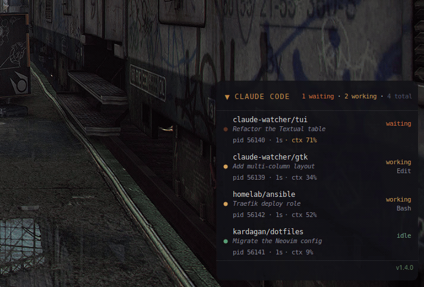

# Claude Code Watcher — GTK

> [Version française](README_FR.md)

A GTK3 desktop widget for Ubuntu that monitors all running Claude Code sessions on your machine and displays them in a persistent overlay — similar to a Conky system monitor.

<p align="center">
  
</p>

## Features

- Detects all active Claude Code sessions automatically
- Shows each session's status in **real time**:
  - **Waiting** (orange) — Claude replied, waiting for your input
  - **Working** (amber) — Claude is processing your message, with tool name
  - **Idle** (green) — session paused
- Context window usage (`ctx%`) shown when available
- Click a session row to focus its terminal window
- Right-click a session row for its menu (focus, or close an idle session — sends `SIGTERM`)
- Right-click the header for the global context menu (show/hide, snooze, settings, quit)
- Middle-click to snooze/wake (fades the widget for a configurable duration)
- **Shift + mouse wheel** adjusts opacity live
- Mouse wheel on the title bar — or the ▾/▸ chevron — rolls the widget up/down
- Multi-column layout for many sessions, with a configurable max height and a scrollbar beyond it
- Configurable global hotkey (default `<Ctrl><Alt>q`) to start keyboard navigation
- Drag the header or footer to reposition freely — position is remembered across restarts
- Systray icon with global status indicator
- Footer shows the installed version with an update indicator (green = up to date, red = a newer release is available)
- Language auto-detected from system locale (`fr` / `en`)

> [!NOTE]
> Click-to-focus is limited on GNOME Wayland. The rest of the widget works
> normally. See [`doc/ARCHITECTURE.md`](doc/ARCHITECTURE.md#click-to-focus) for the details.

## Requirements

- Ubuntu / Debian (X11 or Wayland/GNOME)
- Python 3 (`/usr/bin/python3`)
- GTK3 + GObject introspection libraries

```bash
sudo apt install python3-gi gir1.2-gtk-3.0 gir1.2-wnck-3.0 gir1.2-appindicator3-0.1 wmctrl xdotool
```

Optional — required for Kitty terminal focus:
- `allow_remote_control yes` + `listen_on unix:/tmp/kitty` in `kitty.conf`

## Install

```bash
curl -fsSL https://github.com/claude-watcher/gtk/releases/latest/download/install.sh | bash
```

Pin a specific version instead of the latest:

```bash
curl -fsSL https://github.com/claude-watcher/gtk/releases/download/v1.4.0/install.sh | bash
```

To **upgrade**, just re-run the `latest` one-liner.

The installer will:
1. Install missing apt dependencies
2. Install the script to `~/.local/share/claude-watcher/`
3. Write `~/.config/claude-watcher/config.ini` (skipped if it already exists)
4. Add an app-menu launcher and register autostart so the widget launches at login

To **uninstall** (removes the script and desktop entries; keeps your config):

```bash
./install.sh --uninstall
```

<details>
<summary>From a local clone (development)</summary>

```bash
git clone https://github.com/claude-watcher/gtk
cd gtk
./install.sh          # installs the checked-out script, no download
```
</details>

> **No hook to install:** status comes from Claude Code's own session files,
> so there's nothing to add to your `settings.json`.

> **Note:** Must use `/usr/bin/python3`, not a Homebrew/pyenv Python — those don't
> have access to system GTK bindings.

## Usage

The widget starts automatically after install. To launch it manually, use the
**Claude Code Watcher** app-menu entry, or:

```bash
/usr/bin/python3 ~/.local/share/claude-watcher/claude-watcher &
```

It starts anchored to the **bottom-right corner** of the configured screen. Drag
the header or footer bar to move it freely — the position is saved and restored on next launch.

All settings are editable from the **Settings** screen (right-click → Settings) —
no need to touch a config file by hand.

### CLI overrides

```
--screen N          monitor index
--corner CORNER     bottom-right | bottom-left | top-right | top-left
--x PX --y PX       absolute position (disables corner anchor)
--margin-x PX       horizontal margin from corner
--margin-y PX       vertical margin from corner
--no-tray           disable systray icon
--list-screens      print detected monitors and exit
```

## How it works

For the technical details — session detection, click-to-focus internals, GTK
window specifics, and known limitations — see [`doc/ARCHITECTURE.md`](doc/ARCHITECTURE.md).
